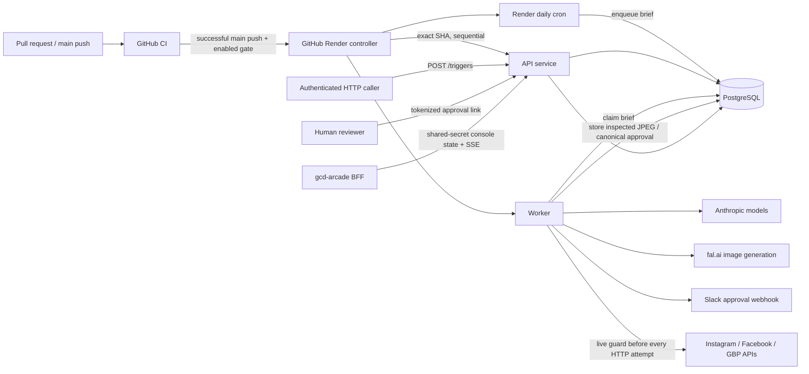

# GCD-Agents / GCD-SOCIAL

GCD-Agents is the repository for GCD-SOCIAL, a Node.js/TypeScript system that generates, reviews, queues, and conditionally publishes social posts for German Car Depot. The repository root is the only active application tree. The deployed shape declared in `render.yaml` is an HTTP API, a long-running orchestration worker, a daily scheduler, and PostgreSQL.

**Verified handoff status (2026-08-24):** Phase 0A and its production discovery are complete. Read-only Render inspection confirmed production at commit `30d06f95f32c46f9952bc63f0bc34a6040d40a09` in workspace `tea-d4fkclpr0fns73abmnh0`, with API `srv-d8u0qtpo3t8c73c5o44g`, worker `srv-d8u0qtpo3t8c73c5o440`, scheduler `crn-d8ulb4rtqb8s73bdjctg`, and PostgreSQL `dpg-d8u0qaho3t8c73c5nj40-a`. The rollout exposed a real ordering failure: native concurrent auto-deploy started the worker before API migration 005 completed, so the worker crashed twice on the missing `approval_decisions` table and recovered only after migration. Phase 0D therefore adds comprehensive GitHub CI and a separate, initially disabled, exact-SHA Render deployment controller that stops on migration changes and otherwise serializes API → health → worker → scheduler. No Phase 0B functionality is included, and this Phase 0D source change does not alter Render settings, deploy, migrate, create GitHub configuration, or contact publishing providers.

## If you have to take over today

1. Confirm the Render identities above against current read-only service records; do not infer production state from `render.yaml` alone.
2. Check `GET /healthz`, then inspect Render logs and database queue counts. Health is liveness/config state, not a database or provider probe.
3. Confirm `AUTONOMY_PHASE=A`, verify `ACTIVE_PLATFORMS`, and suspend the daily scheduler and worker if approval or publishing integrity is uncertain. The code now keeps the approval gate active in every parsed autonomy phase, but Phase A remains the only approved operating mode.
4. Review pending/running `brief_queue` rows, pending approvals, recent events, failed outcomes, token-refresh alerts, and the most recent platform post IDs externally. A Phase 0A rollout deliberately revokes legacy pending/approved approval rows; drain or reject them and arrange fresh review rather than trying to preserve old links.
5. Set a strong nonempty `CONSOLE_TOKEN` before starting the API. It is the transitional shared secret for `/triggers`, `/diag/*`, and `/console/*`; send it as `Authorization: Bearer ...` or `x-console-token`, never in a query string.
6. Never approve a package merely to test the pipeline. Use offline self-tests and dedicated platform test accounts.
7. Read [Deployment control](docs/DEPLOYMENT.md), [Operations](docs/OPERATIONS.md), [Security and continuity](docs/SECURITY_AND_CONTINUITY.md), and [Status](docs/STATUS.md) before changing production state.

## Active repository map

| Path | Classification | Purpose |
|---|---|---|
| `src/api/` | Active runtime | HTTP liveness, diagnostics, triggers, approval UI/actions, media, and console routes |
| `src/worker/` | Active runtime | Claims briefs, runs orchestration, waits for approval, and invokes publishing |
| `src/scheduler/` | Active runtime | Enqueues one daily content brief |
| `src/harness/` | Active | Configuration, orchestration, state, approval, token refresh, image QC, dry runs, and self-tests |
| `src/mcp/` | Active library | Provider-agnostic image and native social-publishing implementations; not standalone MCP server processes |
| `state/migrations/` | Authoritative schema | Forward-only PostgreSQL migrations |
| `agents/` | Active prompt contracts | Agent Markdown bodies and model IDs loaded by the orchestrator |
| `skills/` | Active reference content | Brand/workflow specifications, but not automatically loaded into current model calls |
| `prompts/MASTER_PROMPT.md` | Dormant/experimental | Loaded by an unused manager-turn harness, not by the production worker loop |
| `config/approved-facts.json` | Active business facts | Authoritative `approvedFacts` replacement for copywriter/formatter/critic calls; contains public identifiers but no enforced provenance/freshness metadata |
| `assets/brand/` | Active assets | Brand tokens and raster-in-SVG artwork |
| `.github/workflows/ci.yml` | Active control | Pull-request/main CI, PostgreSQL integration, AgentShield, and workflow validation |
| `.github/workflows/deploy-production.yml` | Disabled pending cutover | Serialized exact-SHA production controller gated by `RENDER_DEPLOY_AUTOMATION_ENABLED` |
| `scripts/ci/`, `scripts/render/` | Active validation/control | Repository checks, Render controller, and offline fixture tests |
| `vendor/` | Pinned reference only | ECC license/provenance and non-executed reference content |
| `docs/archive/` | Historical only | Superseded plans and cross-repository prompts |

The tracked `.DS_Store` is generated OS metadata and should be removed in a separate cleanup change; `.gitignore` already excludes future copies.

## Architecture and data flow



1. The scheduler or `POST /triggers` inserts a JSON brief into `brief_queue`.
2. The worker claims the oldest pending brief with `FOR UPDATE SKIP LOCKED`.
3. The checked-in canonical fact file replaces only `approvedFacts`; other scheduler-authored brief fields such as theme, make, service, and day index remain available. Code fans out analytics, copywriter, image-specification, and SEO calls. It normalizes the requested shared-feed size to one of `1080x1350`, `1080x1080`, `1200x900`, or `1200x630` (default `1080x1350`) and accepts image bytes only from direct HTTPS `fal.media` URLs without credentials, fragments, nonstandard ports, or redirects. The intermediate download is capped at 20 MiB/30 seconds, and the returned PNG/JPEG header must use that exact requested profile before decode; broader decode bounds remain 4,096 pixels per side and 16 million total. Runtime converts at deterministic JPEG quality 90, requires at most 5 MiB, revalidates the transcoded header against the same profile before storage/hash binding, and requires strict vision QC for both legible text and privacy/safety/material integrity. Only passing bytes are stored under a SHA-256 content-addressed application URL. One inspected artifact is shared across active platforms; no separate platform crop/rendition is produced. Initial images and every critic-requested image revision pass the same fail-closed generation/provenance/QC gate.
4. On every revision cycle, the formatter runs first, code constructs and validates the complete canonical package and exact `PostPackage[]`, recursively freezes them, and the critic evaluates that final package. Each payload includes the account/location and exact provider API host/version selected from runtime configuration; no token is included. The social-post subject must be a nonempty array in which every package passes strict validation and each platform appears at most once. A failure after the bounded cycle count escalates without an approval request; the best-effort Slack escalation formats bounded goal/reason/run-ID values as inert previews by neutralizing controls, links, mentions, and backticks.
5. Before creating an approval, the worker requires a validated exact HTTPS `hooks.slack.com/services/...` webhook in every environment; a blank webhook is valid only for paths that do not run worker approval delivery, such as direct offline `createApproval` tests. Production additionally requires a public root HTTPS `PUBLIC_BASE_URL`. The worker stores the canonical provider array with a subject type and SHA-256, plus expiry/revocation state and only the SHA-256 of a random decision token. Each model-authored Slack summary line is bounded, sanitized, and then code-delimited so control characters, mrkdwn, links/bare domains, mentions, and backticks remain inert; the generated review URL is the message's sole active link and is labeled authoritative. Delivery uses bounded retries with a 10-second timeout per attempt and refuses redirects. Failed or uncertain delivery must finish with confirmed revocation; inability to confirm revocation surfaces both errors for operator reconciliation and exposes no approval handle. The API records at most one approve/reject decision atomically, after revalidating the whole subject.
6. After approval, no content mapping is allowed. The posting library reloads/checks the entire subject at entry and issues a module-private package-bound guard that a caller cannot forge with a no-op object. Immediately before every provider HTTP attempt, including read-only Instagram status polls and all retries, that guard repeats the durable hash/decision/type/status/expiry/revocation/index/exact-payload and whole-subject checks, revalidates runtime account/location/host/version against the approved target, and verifies each approved media URL/digest against the immutable PostgreSQL content fields/current bytes. It also requires those live bytes to remain a no-more-than-5-MiB JPEG in one of the allowed exact feed profiles. Request construction enforces the same target match. Native requests reject redirects, and a 2xx publication response without the required provider post ID is a failure.
7. Results, events, media, session/token state, and brief outcome persist in PostgreSQL. There is no durable task broker beyond table polling.

See [Architecture](docs/ARCHITECTURE.md) and [Data model](docs/DATA_MODEL.md).

## Runtime components and schedules

| Component | Command | Behavior |
|---|---|---|
| API | `npm run start:api` | Node HTTP server on `PORT`; optional `API_BIND_HOST` restricts local/test binding, while Render leaves it unset |
| Worker | `npm run start:worker` | Polls PostgreSQL every 10 seconds; one claimed brief at a time per process |
| Scheduler | `npm run start:scheduler` | Render cron `0 13 * * *`; enqueues and exits |
| Migration runner | `npm run migrate` | Applies unapplied SQL migrations transactionally |

The scheduler fires at 09:00 Eastern during daylight time and 08:00 during standard time. It enqueues one brief; it does not publish. A worker restart can strand a `running` brief because no stale-claim recovery job exists.

## HTTP and trust surface

- `GET /healthz`: public liveness/config summary.
- `GET /diag/ig` and `/diag/gbp`: require `CONSOLE_TOKEN`, are limited to 20 requests/minute by the API process, and have bounded provider/request time. They still make live provider calls and expose operational identifiers/status without returning token values.
- `POST /triggers`: requires `CONSOLE_TOKEN`, is limited to 5 requests/minute, requires `application/json`, and accepts only `{ "goal": <nonempty string of at most 2,000 characters> }`. Unknown fields, including caller-supplied facts, are rejected; bodies are limited to 16 KiB with a 10-second read timeout. The server also applies 10-second header/complete-request receive deadlines with one-second expiry-scan granularity, and early body-bearing authentication/content-type rejections close their socket without draining unread bytes.
- `GET /approvals/:id?token=...` and `POST /approvals/:id/decision`: transitional token-gated human review for UUID-shaped IDs. Both routes consume a process-local 300 requests/minute direct-socket bucket and a 30 requests/minute direct-socket-plus-approval-UUID bucket. The page verifies the bound hash and shows every package field—including destination and media digest—plus authoritative canonical JSON, hash, and both expiries; responses use no-store, no-referrer, framing/content restrictions, and a narrow CSP. Only the token hash is stored, but the token still appears in the Slack/browser URL and expires after 24 hours by default. The separately bounded publication authorization also expires after 24 hours by default and can be revoked, although no HTTP revocation endpoint is provided. Decision forms require URL-encoded bodies under the shared 16-KiB/10-second bounds.
- `GET /media/:id-:sha256.jpg`: intentionally public, content-addressed JPEG route for new canonical media, with one-year immutable caching and a digest ETag. Legacy `GET /media/:id.jpg` remains read-only so already-published URLs continue to resolve.
- `/console/manifest|state|stream`: require the same transitional `CONSOLE_TOKEN` and are limited to 120 requests/minute. Query-string credentials and wildcard CORS were removed. State/stream expose operational activity to an authenticated caller.

Bearer and `x-console-token` headers are both supported; if `CONSOLE_TOKEN` is absent, protected routes fail with service unavailable. Fixed-window limiters are process-local. Control/authentication buckets use the direct socket address; approval review adds the normalized UUID to its narrower key. Behind an unconfigured proxy the 300/minute approval-global and control buckets can act service-wide. This is a transitional shared-secret control plane, not user/session identity. Authentication failures are separately limited to 60 requests/minute. The cron scheduler writes directly to PostgreSQL rather than calling the API.

## Guardrails and verified limitations

- Every publishing path requires a durable approval ID plus package index. A fabricated boolean or guard, empty/malformed/duplicate-platform subject, mismatched payload/destination/media, wrong index/type, non-approved state, expired authorization, revoked approval, or changed stored payload fails closed before provider I/O. The complete subject is revalidated before creation, decision, durable load, and publication. No `AUTONOMY_PHASE` value disables this gate.
- API, worker, and scheduler entry points require durable PostgreSQL state, probe connectivity, the migration-005 approval/media columns, both approval integrity constraints, and four integrity triggers before starting, and fail when `DATABASE_URL` is absent, unreachable, or incompatible. Explicit in-memory state remains only for offline harness/self-test paths that do not request durable state; even an ephemeral approved subject cannot cross the publication boundary.
- The worker starts its 12-hour Instagram token tick only when Instagram is in `ACTIVE_PLATFORMS`. The default Instagram-login path persists/refreshes that token in PostgreSQL; the alternate Facebook-login host uses the environment token and is not refreshed by this module. After approval it calls the current-token helper only when the exact approved array contains Instagram, and attempts Google OAuth refresh only when that array contains GBP; unrelated platform token acquisition is skipped.
- Production `runBrief` rejects injected agent-runner, image-resolver, and publication-target seams, and production vision QC rejects an injected inspector runner. Those seams remain available only to offline tests/simulated dry-run; the simulated CLI scrubs sensitive environment values, forces `NODE_ENV=test`, and injects canned fixtures before loading configuration-bearing modules.
- Agent `tools:` frontmatter is descriptive only. Current model calls have no tools and receive only the agent Markdown body plus input JSON. Referenced `skills/` are not automatically injected.
- The “manager agent” master prompt is not used by the production worker; orchestration is deterministic TypeScript.
- Model-returned media URLs/provenance are not trusted. Missing generation/hosting configuration, an untrusted/redirected source URL, oversized/non-image bytes, a vision-QC infrastructure or response-contract error, garbled text, identifying faces/features, readable plates/VIN/contact/customer records, unsafe shop practice, materially misleading imagery, or exhausted retries all fail closed and escalate without approval.
- Deterministic package checks require exact coverage of active platforms, a valid approval-bound provider destination, nonempty/limited copy, explicit language layout, exactly one Instagram image with alt text/AI disclosure, content-addressed media URL/digest parity, 8–15 unique provider-visible Instagram hashtags exactly matching the canonical list, at most two Facebook hashtags, no GBP hashtags, GBP's explicit language/topic type, 1,500-character limit and approved-fact CTA URL, matching review/provider media, and HTTPS URLs. Native FB/GBP requests support the image URL but not alt/AI fields, so those unsupported fields are omitted rather than shown as provider-bound. The package still records runtime AI provenance, and the legacy flow remains one GBP locale (English when available), while Instagram/Facebook combine English then Spanish.
- No durable idempotency key or provider operation ledger exists. Provider retries and crash recovery do not provide exactly-once publishing.
- `brand_scorecard` and `self_improvement_proposals` tables exist, but the active worker does not write them.

## Local development and validation

Requires Node 22 and npm. PostgreSQL is optional for offline self-tests but required for durable API/worker/scheduler behavior.

```bash
npm ci
cp .env.example .env
npm run build
npm run typecheck
npm run test:posting
npm run test:image
npm run test:orchestrator
npm run test:gate
npm run test:api
npm run dryrun
npm run test:deployment-controller
npm run check:markdown-links
npm run check:env-coverage
npm run scan:sensitive
```

The PostgreSQL and bound-server suites are intentionally opt-in. Against a uniquely disposable loopback PostgreSQL server/database only, run `PHASE0A_DISPOSABLE_POSTGRES=1 PHASE0A_POSTGRES_ADMIN_URL='postgresql://<test-user>:<test-password>@127.0.0.1:<port>/postgres' npm run test:postgres`, then run `DATABASE_URL='postgresql://<test-user>:<test-password>@127.0.0.1:<port>/<migrated-disposable-db>' npm run test:http-e2e`. The first command creates and removes its own random databases; the second requires a separate migrated non-default database and starts the compiled API bound to `127.0.0.1` with outbound fetch denied.

Do not run `dryrun:live`, diagnostics, migrations, the scheduler, the worker, or a real approval/posting path without an identified environment and explicit authority. See [Testing](docs/TESTING.md).

## Deployment, recovery, and rollback

`render.yaml` declares PostgreSQL plus API, worker, and scheduler services. The API applies migrations in `preDeployCommand`; migrations are forward-only. Native Render auto-deploy is still enabled on the three live services and must remain the only authority until the explicit cutover. The GitHub deployment workflow is disabled unless `RENDER_DEPLOY_AUTOMATION_ENABLED` is exactly `true`; after cutover it accepts only the successful same-repository `CI` result for a `main` push and, after acquiring the serialized release slot, requires that result's `TARGET_SHA` still equal current `origin/main`. A superseded result touches no Render service. The controller derives `LIVE_SHA` from the API's current live deploy, performs no deployment when all three services already report the target, compares `LIVE_SHA..TARGET_SHA`, blocks every release that changes `state/migrations/**`, and otherwise deploys API, worker, and scheduler sequentially with health/startup/final-SHA checks and bounded redacted failure evidence. It never runs a production migration directly. See [Deployment control](docs/DEPLOYMENT.md) for the GitHub contract, cutover order, and rollback limits.

The checked-in API service has no Anthropic or approval-webhook secret because it does not use them; provider credentials remain there only for authenticated diagnostics, while model/image/Slack approval work stays on the worker. Phase 0A migration 005 is already part of the current production commit, but future migration-bearing releases still require a separately authorized, exactly-one-runner rollout. A timeout is a stop-and-investigate signal, not permission to loop retries. Application rollback cannot safely resurrect revoked approval links, delete immutable media, or undo platform posts, Slack messages, model/image spend, or database migrations.

No checked-in backup job, restore drill, queue reaper, media/event retention task, or posting reconciliation job was found. Detailed procedures and honest limitations are in [Operations](docs/OPERATIONS.md).

## Immediate risks and follow-ups

- Replace the transitional shared `CONSOLE_TOKEN` with separately scoped identities, a trusted-proxy-aware distributed limiter, and explicit Arcade origin policy.
- Replace token-bearing approval URLs with an authenticated review session and capture a real reviewer identity. Approval tokens are now hash-only at rest, but URL/history leakage remains; Instagram tokens still persist plaintext.
- Implement durable platform idempotency/reconciliation before relying on retry safety.
- Add recovery for stranded `running` briefs and retention for events/approval packages. Migration 005 deliberately forbids deletion of every media row; a safe retention design requires a later reviewed migration and must preserve already-published legacy/current URLs.
- Decide and implement a research-reference contract for fact source, confidence, freshness, and last-review metadata before Phase 0B. Phase 0A makes checked-in facts authoritative against caller override but does not prove they are current.
- Wire skill content into model calls or stop claiming it is automatically loaded.
- Add real scorecard/proposal persistence or remove dormant schema/promises.
- Verify production provider scopes, IDs, account ownership, the exact approval-bound destinations, Render settings, backups, and actual platform behavior.
- Restrict the production PostgreSQL external allowlist from the discovered `0.0.0.0/0` in a separate authorized security change.
- Observe the scheduler's next normal production execution; do not trigger it manually merely to close the discovery gap.

## Documentation source of truth

Executable source, migrations, tests, and checked-in configuration define behavior. This README is the zero-context handoff. Current runbooks are [Architecture](docs/ARCHITECTURE.md), [Deployment control](docs/DEPLOYMENT.md), [Operations](docs/OPERATIONS.md), [Integrations](docs/INTEGRATIONS.md), [Data model](docs/DATA_MODEL.md), [Environment](docs/ENVIRONMENT.md), [Security and continuity](docs/SECURITY_AND_CONTINUITY.md), [Testing](docs/TESTING.md), and [Status](docs/STATUS.md). Historical plans are indexed in [the archive](docs/archive/README.md).

**Documentation is part of every change.** The binding acceptance rule is in [AGENTS.md](AGENTS.md).
