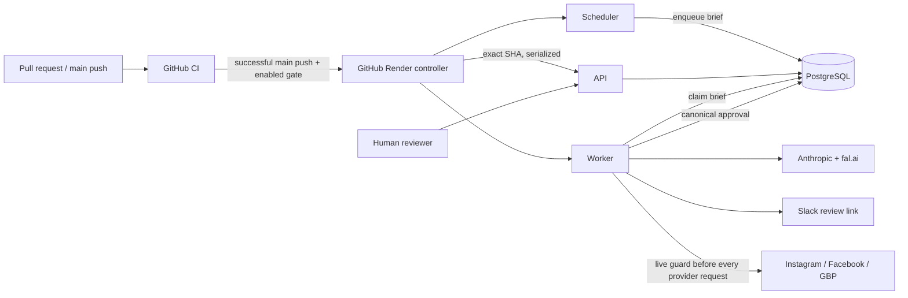

# GCD Content Intelligence / GCD-SOCIAL

This repository is the current production foundation for German Car Depot's Content Intelligence Platform, or Content OS. Today it is a Node.js/TypeScript system that creates, reviews, queues, and conditionally publishes organic social content. The longer-term objective is a governed automotive media engine that earns massive qualified reach, followers, repeat viewing, affinity, engagement, GCD authority, and local market dominance before optimizing for attribution, leads, and revenue.

V1 is organic-first. Humans still film content, and CapCut or another external editor remains the editing path. An in-browser video editor is not current scope.

> Research gives us the prior. GCD empirical performance becomes the posterior.

Evidence may be collected automatically, but prompts, skills, production process, agent behavior, and publishing rules must change only through governed review. Agents reason; deterministic services retrieve, validate, mutate, store, enforce, and publish. Automotive truth, safety, privacy, and approval integrity are hard constraints. Never fabricate a diagnosis, failure or repair evidence, customer facts, or shop evidence. Prefer real GCD evidence over generic decorative imagery.

## Start here

New AI agents should read [Start here](docs/START_HERE.md), then the concise [AI engineering handoff](docs/AI_HANDOFF.md). The short current source of truth is [Status](docs/STATUS.md).

| Document | Purpose |
|---|---|
| [AI engineering handoff](docs/AI_HANDOFF.md) | Mission, orientation, current operation, next action, and authority boundaries |
| [Status](docs/STATUS.md) | Verified current repository, production, and deployment-authority state |
| [Roadmap](docs/ROADMAP.md) | Canonical work sequence and current cursor: phase-state vocabulary, completed history, hardening order, Phase 0B, and later work |
| [Architecture](docs/ARCHITECTURE.md) | Current production design versus target Content OS design |
| [Deployment control](docs/DEPLOYMENT.md) | Exact CI/controller contract, current cutover state, and migration boundary |
| [Operations](docs/OPERATIONS.md) | Health, routine operation, incident response, and recovery |
| [Security and continuity](docs/SECURITY_AND_CONTINUITY.md) | Trust boundaries, risk register, secrets, and takeover |
| [Testing](docs/TESTING.md) | Offline/static validation, disposable integration tests, and CI |
| [Data model](docs/DATA_MODEL.md) | Authoritative tables, invariants, migration, retention, and recovery |
| [Integrations](docs/INTEGRATIONS.md) | External-system responsibilities and failure boundaries |
| [Environment](docs/ENVIRONMENT.md) | Application and GitHub control-plane variable contracts |
| [Credential setup](docs/credentials-setup.md) | Provider and deployment setup without secret values |

`docs/archive/` is historical only. Current source, this README, and active runbooks take precedence.

## Handoff snapshot

**Repository `main` and the live production release are intentionally different commits.** Do not treat them as facts that ought to match, and do not read exact SHAs from this file — [Status](docs/STATUS.md) is authoritative for every mutable identifier and records how fresh each one is.

- `main` carries Phase 0A (PR #33), Phase 0D (PR #34), the documentation reconciliation (PR #35), and the **worker ownership and recovery work (PR #36)**. Migration `state/migrations/005_approval_integrity.sql` is applied; PR #36 added no migration.
- **Production is running the Phase 0D release and does not yet contain the ownership work.** The worker live today does not take the advisory lock and cannot be fenced by it.
- At the last full read-only verification, **2026-08-24 21:32 UTC**: all three services were live and healthy at the Phase 0D SHA, Render native auto-deploy was **off** on API, worker, and scheduler, the GitHub `production` environment and its five non-secret variables were configured, and repository variable `RENDER_DEPLOY_AUTOMATION_ENABLED` was **false** — intentionally leaving **no unattended deployment authority**. None of those facts has been reverified since; treat them as last-verified rather than current.
- A normal scheduled execution of the current production SHA **was** observed on 2026-08-25 and that gap is closed. Do not trigger production cron for evidence.
- Production PostgreSQL external access allowed `0.0.0.0/0` at last verification. Restriction is a separate high-priority security change.
- **The next operation is not the deployment gate.** Because the ownership fix is merged but not deployed, its first production release is a separately authorized **manual Render bootstrap performed while the gate stays `false`**. Only after that worker is live and its handoff behavior is proven does enabling the gate become eligible. [Roadmap](docs/ROADMAP.md) holds the ordered cursor.

Service IDs and exact control-plane configuration are recorded in [Status](docs/STATUS.md) and [Deployment control](docs/DEPLOYMENT.md). Do not infer mutable production facts from `render.yaml` alone.

## What runs today



- `src/api/`: health, authenticated triggers/diagnostics/console, approval review/actions, and public content-addressed media.
- `src/worker/`: queue consumption, deterministic orchestration, human approval wait, and the only publication handoff.
- `src/scheduler/`: daily `0 13 * * *` enqueue; it does not publish.
- `src/harness/`: configuration, state, orchestration, approval, image QC, dry runs, and self-tests.
- `src/mcp/`: imported provider libraries, not standalone MCP servers or model tools.
- `state/migrations/`: forward-only PostgreSQL schema authority.
- `agents/`: model prompt bodies and model IDs actually loaded by the orchestrator.
- `skills/`: reviewed specifications, but not automatically injected into current model calls.
- `prompts/MASTER_PROMPT.md`: dormant/experimental; the production worker does not run an Opus manager.
- `.github/workflows/ci.yml`: comprehensive Node 22, offline/static, PostgreSQL 16/18, AgentShield, and workflow validation.
- `.github/workflows/deploy-production.yml`: exact-SHA serialized Render controller; currently disabled by the repository gate.

The current reasoning flow is analytics, copywriter, image specification, hashtag/SEO/timing, platform formatter, and final critic under deterministic TypeScript control. It is not yet the target six-stage Content OS architecture, does not inject skills/references at runtime, and does not implement empirical learning. See [Architecture](docs/ARCHITECTURE.md) and [Roadmap](docs/ROADMAP.md).

## Phase 0A guarantees

Phase 0A is complete and production-deployed. It protects control routes; binds review to one canonical nonempty, strict-valid, unique-platform provider subject; stores payload and decision-token SHA-256 values; enforces expiry, revocation, and one append-only atomic decision; and requires durable PostgreSQL approval for publication. The reviewer sees the exact provider subject, and no visible transformation follows approval.

Immediately before every provider HTTP attempt—including Instagram status reads and retries—the module-issued guard revalidates the durable decision, exact payload and index, destination, runtime target, media digest, current immutable bytes, and provider-relevant constraints. Trusted-media acquisition is host/redirect/time/size/dimension bounded, normalized to one reviewed feed profile, transcoded to a bounded JPEG, and subjected to fail-closed privacy, safety, material-integrity, and text QC. Production entry points fail startup without reachable, migration-compatible PostgreSQL.

Migration 005 deliberately invalidated legacy unbound approvals, removed plaintext decision-token storage, added immutable decisions/approval metadata/media digests, and forbids media mutation/deletion. Its production rollout exposed the worker-before-migration race that motivated Phase 0D. See [Data model](docs/DATA_MODEL.md).

## Phase 0D guarantees and current boundary

Phase 0D is complete in source and deployed. GitHub CI validates pull requests and `main`. The production workflow accepts only a successful same-repository `main` push CI result, rejects superseded targets after acquiring the serialized slot, selects exact `TARGET_SHA` and actual Render `LIVE_SHA`, requires ancestry, and blocks any `LIVE_SHA..TARGET_SHA` migration change before a production action. Migration-bearing releases require a separate controlled rollout with stopped incompatible consumers and exactly one migration runner.

For migration-free releases the controller deploys API first, verifies exact application/release health using a transport-bounded 4,096-byte body plus one overflow probe byte, deploys worker second, requires exact target-bound readiness and a 10-second stabilization observation, deploys scheduler last, and finally verifies all three SHAs. It does not automatically loop failed deploys. Failure evidence is bounded, recursively redacted with reviewed fallback patterns, and rendered Markdown/HTML inert.

The controller is not yet enabled or production-proven. [Deployment control](docs/DEPLOYMENT.md) is authoritative for the current cutover.

## Publication media normalization

**Merged in PR #38; not deployed and not production-validated. Fixes an active production blocker** — since 2026-08-25 scheduled briefs failed before reaching approval with `image dimensions 1024x1024 are not an approved cross-platform feed profile`. Scheduled posting stays blocked until this release is live.

Image providers guarantee **composition, not exact publication pixels**. fal normalizes a requested `image_size` to its own resolution buckets and may return PNG despite a JPEG request. The pipeline previously asserted the exact publication-profile allowlist against the raw provider download and never resized, so any provider-native size was fatal.

Two policies are now distinct: **decode safety** governs bytes we will process, **publication profile** governs bytes we will publish. The provider render is an input; the artifact is produced here.

- **Uniform scale only.** Cropping and padding are refused, not unimplemented — cropping 1:1 into 4:5 would cut 20% of the frame through the headline. A mismatched aspect fails closed.
- **Normalize before approval.** Resize and JPEG transcode happen before QC, hashing, hosting, and approval, so the bytes a reviewer approves are byte-for-byte the bytes that publish. There is no post-approval transformation.
- **Not retryable.** An aspect mismatch is a deterministic media-contract failure: the request is identical every attempt, so it escalates after exactly one generation instead of burning three.
- **Policy unchanged.** No provider size was added to the four approved profiles, and the durable publication guard is unchanged in strength.

## Worker ownership and recovery

**Merged to `main` in PR #36. NOT deployed and NOT production-validated.** This section describes current source and the next production release, not current production runtime. Phase 0D.1 remains paused: Render native auto-deploy stays off and `RENDER_DEPLOY_AUTOMATION_ENABLED` stays `false`, and the first release of this code is a separately authorized manual bootstrap rather than a gate enablement.

Render background-worker deploys are zero-downtime, so the old worker stays alive for roughly a minute after the new one starts. A starting worker therefore cannot assume a `running` brief was abandoned. Exactly one worker is the owner, established by a PostgreSQL session-level advisory lock held on a dedicated connection for the process lifetime, released automatically when that session ends.

- **Ownership gates everything.** A worker waits — reconciling nothing, emitting no readiness, consuming nothing — until it acquires the lock. The `pending → running` claim runs on the ownership session itself, so a brief can only be claimed by a process that is still the exclusive owner at commit.
- **Recovery runs before readiness.** Once ownership is held, every remaining `running` brief provably has no live owner and is classified from its durable phase markers, then terminalized. Nothing is resumed, retried, or returned to `pending`, and recovery issues no provider request.
- **Durable phase markers are safety state, not telemetry.** `brief:approval_requested`, `brief:publish_attempt_started`, `brief:publish_attempt_settled`, and `brief:publish_attempt_abandoned` each commit before the side effect they describe, so an interrupted brief is classified exactly rather than guessed at. `recordEvent` keeps its best-effort telemetry contract; these use a separate failure-propagating primitive.
- **Losing ownership ends the process.** A worker that loses the lock writes nothing further, declines every terminal write so it cannot overwrite a successor's recovery, and exits nonzero for restart.
- **Readiness now means four things at once:** durable state initialized, exclusive ownership held, abandoned work reconciled, and mandatory initialization complete.

Runbooks live in [Operations](docs/OPERATIONS.md) (lifecycle and reconciliation), [Deployment control](docs/DEPLOYMENT.md) (readiness window and the one-time manual bootstrap release), [Data model](docs/DATA_MODEL.md) (marker contract and advisory key), and [Security and continuity](docs/SECURITY_AND_CONTINUITY.md) (trust boundaries and residual risk).

## Local validation

Node 22 is required. The routine offline/static sequence is:

```bash
npm ci
npm run typecheck
npm run build
npm run test:offline
npm run dryrun
npm run test:deployment-controller
npm run check:markdown-links
npm run check:env-coverage
npm run scan:sensitive
npm audit --omit=dev
git diff --check
```

PostgreSQL and bound HTTP suites are opt-in and refuse non-loopback/default targets. Use only uniquely disposable local databases as described in [Testing](docs/TESTING.md). Never run `dryrun:live`, diagnostics, migrations, scheduler/worker, approval decisions, model/image calls, or provider publishing against an unidentified environment or without explicit authority.

The tracked `.DS_Store` is unrelated generated OS metadata. `.gitignore` blocks future copies; remove the tracked file only in a separate explicitly scoped cleanup.

## Documentation and roadmap rules

Both rules are binding and live in [`AGENTS.md`](AGENTS.md); [`CONTRIBUTING.md`](CONTRIBUTING.md) carries the matching definition of done.

**Documentation is part of every change.** A change is not complete until every affected Markdown file, environment example, runbook, diagram, command, path, inline operational note, and external setup description is updated in the same atomic change; instructions that no longer apply are removed or explicitly archived; every modified document is reread whole; documented paths, commands, variables, service names, routes, schedules, links, and identifiers are verified against source; this README is updated whenever architecture, data flow, deployment, security, operations, ownership, recovery, or external dependencies change; and unresolved uncertainty, manual prerequisites, rollout gates, and external-system dependencies are recorded rather than presented as completed.

**Roadmap continuity is mandatory.** [`docs/ROADMAP.md`](docs/ROADMAP.md) is the canonical work sequence and current cursor; [`docs/STATUS.md`](docs/STATUS.md) records verified reality. Any change that implements, reorders, blocks, expands, narrows, supersedes, or completes roadmap scope must update the roadmap in the same change — finishing implementation is itself a roadmap-state change. Phase states (`PLANNED`, `IMPLEMENTED`, `MERGED`, `CONFIGURED`, `ENABLED`, `DEPLOYED`, `PRODUCTION-VALIDATED`, `BLOCKED`, `DEFERRED`, `SUPERSEDED`) stay distinct and are never collapsed into "done".
