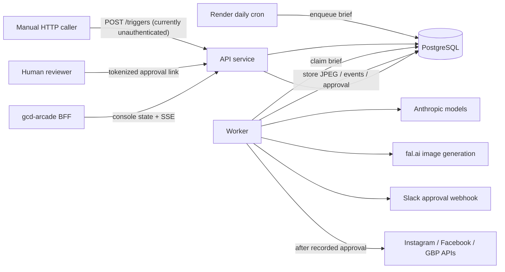

# GCD-Agents / GCD-SOCIAL

GCD-Agents is the repository for GCD-SOCIAL, a Node.js/TypeScript system that generates, reviews, queues, and conditionally publishes social posts for German Car Depot. The repository root is the only active application tree. The deployed shape declared in `render.yaml` is an HTTP API, a long-running orchestration worker, a daily scheduler, and PostgreSQL.

**Verified repository status (2026-08-10):** the code implements deterministic multi-agent orchestration, image generation and vision QC, Slack approval links, native Instagram/Facebook/Google Business Profile publishing, token refresh, PostgreSQL queues/media/events, and the Arcade console feed. The Render/provider accounts and production deployment were not accessed during this audit. Phase A is the checked-in default and requires recorded human approval before publishing. Several roadmap documents overstated completed behavior; the current limitations and security risks below are source-backed.

## If you have to take over today

1. Confirm the Render API, worker, scheduler, and PostgreSQL service identities; do not infer production state from `render.yaml` alone.
2. Check `GET /healthz`, then inspect Render logs and database queue counts. Health is liveness/config state, not a database or provider probe.
3. Confirm `AUTONOMY_PHASE=A`, verify `ACTIVE_PLATFORMS`, and suspend the daily scheduler if approval or publishing integrity is uncertain.
4. Review pending/running `brief_queue` rows, pending approvals, recent events, failed outcomes, token-refresh alerts, and the most recent platform post IDs externally.
5. Protect `/console/state` and `/console/stream` with `CONSOLE_TOKEN`. Treat `/triggers` and `/diag/*` as exposed until application-level authentication is implemented.
6. Never approve a package merely to test the pipeline. Use offline self-tests and dedicated platform test accounts.
7. Read [Operations](docs/OPERATIONS.md), [Security and continuity](docs/SECURITY_AND_CONTINUITY.md), and [Status](docs/STATUS.md) before changing production state.

## Active repository map

| Path | Classification | Purpose |
|---|---|---|
| `src/api/` | Active runtime | HTTP liveness, diagnostics, triggers, approval UI/actions, media, and console routes |
| `src/worker/` | Active runtime | Claims briefs, runs orchestration, waits for approval, and invokes publishing |
| `src/scheduler/` | Active runtime | Enqueues one daily content brief |
| `src/harness/` | Active | Configuration, orchestration, state, approval, token refresh, image QC, dry runs, and self-tests |
| `src/mcp/` | Active library | Provider-agnostic image and native social-publishing implementations; not standalone MCP server processes |
| `state/migrations/` | Authoritative schema | Forward-only PostgreSQL migrations |
| `agents/` | Active prompt contracts | Agent Markdown bodies and model IDs loaded by the orchestrator |
| `skills/` | Active reference content | Brand/workflow specifications, but not automatically loaded into current model calls |
| `prompts/MASTER_PROMPT.md` | Dormant/experimental | Loaded by an unused manager-turn harness, not by the production worker loop |
| `config/approved-facts.json` | Active business facts | Default facts supplied to copywriter/critic calls; contains public business identifiers |
| `assets/brand/` | Active assets | Brand tokens and raster-in-SVG artwork |
| `vendor/` | Pinned reference only | ECC license/provenance and non-executed reference content |
| `docs/archive/` | Historical only | Superseded plans and cross-repository prompts |

The tracked `.DS_Store` is generated OS metadata and should be removed in a separate cleanup change; `.gitignore` already excludes future copies.

## Architecture and data flow



1. The scheduler or `POST /triggers` inserts a JSON brief into `brief_queue`.
2. The worker claims the oldest pending brief with `FOR UPDATE SKIP LOCKED`.
3. Code fans out analytics, copywriter, image, and SEO calls, generates/hosts an image, runs up to three critic cycles, formats a canonical package, and stores a pending approval.
4. Slack receives a review URL containing a one-time approval token. The API records approve/reject; the worker polls for up to 24 hours.
5. Only an approved result is mapped to native platform requests. Instagram uses container/status/publish; Facebook posts to feed/photos; GBP uses `localPosts`.
6. Results, events, media, session/token state, and brief outcome persist in PostgreSQL. There is no durable task broker beyond table polling.

See [Architecture](docs/ARCHITECTURE.md) and [Data model](docs/DATA_MODEL.md).

## Runtime components and schedules

| Component | Command | Behavior |
|---|---|---|
| API | `npm run start:api` | Node HTTP server on `PORT` |
| Worker | `npm run start:worker` | Polls PostgreSQL every 10 seconds; one claimed brief at a time per process |
| Scheduler | `npm run start:scheduler` | Render cron `0 13 * * *`; enqueues and exits |
| Migration runner | `npm run migrate` | Applies unapplied SQL migrations transactionally |

The scheduler fires at 09:00 Eastern during daylight time and 08:00 during standard time. It enqueues one brief; it does not publish. A worker restart can strand a `running` brief because no stale-claim recovery job exists.

## HTTP and trust surface

- `GET /healthz`: public liveness/config summary.
- `GET /diag/ig` and `/diag/gbp`: public in current source; make live provider calls and expose operational identifiers/status without token values.
- `POST /triggers`: public in current source; accepts any JSON with a string `goal`, allowing queue/cost abuse.
- `GET /approvals/:id?token=...` and `POST /approvals/:id/decision`: token-gated human review. Tokens are stored in plaintext and appear in URLs.
- `GET /media/:id.jpg`: intentionally public, long-cache hosted media required by platforms.
- `/console/manifest|state|stream`: CORS-open; all fail open when `CONSOLE_TOKEN` is unset. State/stream expose operational activity.

There is no user/session authentication or rate limiting. The approval token is the only human authorization mechanism, and the cron scheduler writes directly to PostgreSQL rather than calling the API.

## Guardrails and verified limitations

- Phase A posting calls `assertPublishAllowed(true)` only after `waitForApproval` observes an approved database row. The worker publishes the in-memory package associated with that approval.
- `AUTONOMY_PHASE=C` would disable the code-level assertion, but the worker still always creates and waits for an approval; full autonomy is not implemented end to end.
- Agent `tools:` frontmatter is descriptive only. Current model calls have no tools and receive only the agent Markdown body plus input JSON. Referenced `skills/` are not automatically injected.
- The “manager agent” master prompt is not used by the production worker; orchestration is deterministic TypeScript.
- Detected image garble blocks after three attempts, but a vision-QC infrastructure error fails open to the downstream human reviewer.
- `PostPackage.idempotencyKey` is declared but unused. Provider retries and crash recovery do not provide durable exactly-once publishing.
- `brand_scorecard` and `self_improvement_proposals` tables exist, but the active worker does not write them.

## Local development and validation

Requires Node 22 and npm. PostgreSQL is optional for offline self-tests but required for durable API/worker/scheduler behavior.

```bash
npm ci
cp .env.example .env
npm run build
npm run typecheck
npm run test:posting
npm run test:image
npm run test:orchestrator
npm run test:gate
npm run dryrun
```

Do not run `dryrun:live`, diagnostics, migrations, the scheduler, the worker, or a real approval/posting path without an identified environment and explicit authority. See [Testing](docs/TESTING.md).

## Deployment, recovery, and rollback

`render.yaml` declares PostgreSQL plus API, worker, and scheduler services. The API applies migrations in `preDeployCommand`; migrations are forward-only. Back up before deploy, review SQL, and keep new code compatible with the prior schema during rollout. Application rollback cannot undo platform posts, Slack messages, model/image spend, or database migrations.

No checked-in backup job, restore drill, queue reaper, media/event retention task, or posting reconciliation job was found. Detailed procedures and honest limitations are in [Operations](docs/OPERATIONS.md).

## Immediate risks and follow-ups

- Authenticate and rate-limit `/triggers` and `/diag/*`; make console routes fail closed.
- Encrypt persisted Instagram tokens and approval tokens; replace query-string bearer tokens with a safer review session design.
- Implement durable platform idempotency/reconciliation before relying on retry safety.
- Add recovery for stranded `running` briefs and retention for media/events/approval packages.
- Decide whether vision-QC errors should fail closed.
- Wire skill content into model calls or stop claiming it is automatically loaded.
- Add real scorecard/proposal persistence or remove dormant schema/promises.
- Verify production provider scopes, IDs, account ownership, Render settings, backups, and actual platform behavior.

## Documentation source of truth

Executable source, migrations, tests, and checked-in configuration define behavior. This README is the zero-context handoff. Current runbooks are [Architecture](docs/ARCHITECTURE.md), [Operations](docs/OPERATIONS.md), [Integrations](docs/INTEGRATIONS.md), [Data model](docs/DATA_MODEL.md), [Environment](docs/ENVIRONMENT.md), [Security and continuity](docs/SECURITY_AND_CONTINUITY.md), [Testing](docs/TESTING.md), and [Status](docs/STATUS.md). Historical plans are indexed in [the archive](docs/archive/README.md).

**Documentation is part of every change.** The binding acceptance rule is in [AGENTS.md](AGENTS.md).
