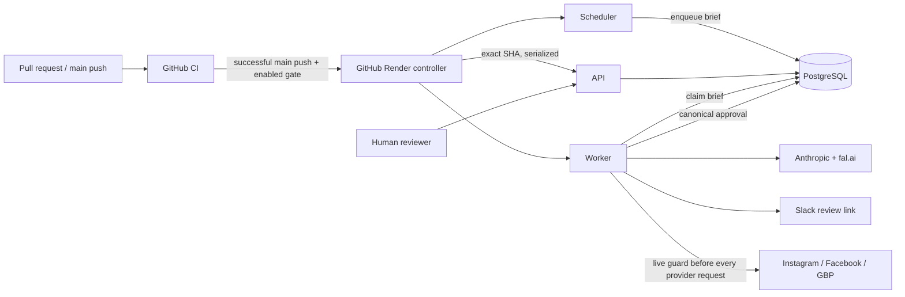

# GCD Content Intelligence / GCD-SOCIAL

This repository is the current production foundation for German Car Depot's Content Intelligence Platform, or Content OS. Today it is a Node.js/TypeScript system that creates, reviews, queues, and conditionally publishes organic social content. The longer-term objective is a governed automotive media engine that earns massive qualified reach, followers, repeat viewing, affinity, engagement, GCD authority, and local market dominance before optimizing for attribution, leads, and revenue.

V1 is organic-first. Humans still film content, and CapCut or another external editor remains the editing path. An in-browser video editor is not current scope.

> Research gives us the prior. GCD empirical performance becomes the posterior.

Evidence may be collected automatically, but prompts, skills, production process, agent behavior, and publishing rules must change only through governed review. Agents reason; deterministic services retrieve, validate, mutate, store, enforce, and publish. Automotive truth, safety, privacy, and approval integrity are hard constraints. Never fabricate a diagnosis, failure or repair evidence, customer facts, or shop evidence. Prefer real GCD evidence over generic decorative imagery.

## Start here

New AI agents should read [Start here](docs/START_HERE.md), then the concise [AI engineering handoff](docs/AI_HANDOFF.md). The short current source of truth is [Status](docs/STATUS.md).

| Document | Purpose |
|---|---|
| [AI engineering handoff](docs/AI_HANDOFF.md) | Mission, orientation, current operation, next action, and authority boundaries |
| [Status](docs/STATUS.md) | Verified current repository, production, and deployment-authority state |
| [Roadmap](docs/ROADMAP.md) | Canonical work sequence and current cursor: phase-state vocabulary, completed history, hardening order, Phase 0B, and later work |
| [Architecture](docs/ARCHITECTURE.md) | Current production design versus target Content OS design |
| [Deployment control](docs/DEPLOYMENT.md) | Exact CI/controller contract, current cutover state, and migration boundary |
| [Operations](docs/OPERATIONS.md) | Health, routine operation, incident response, and recovery |
| [Security and continuity](docs/SECURITY_AND_CONTINUITY.md) | Trust boundaries, risk register, secrets, and takeover |
| [Testing](docs/TESTING.md) | Offline/static validation, disposable integration tests, and CI |
| [Data model](docs/DATA_MODEL.md) | Authoritative tables, invariants, migration, retention, and recovery |
| [Integrations](docs/INTEGRATIONS.md) | External-system responsibilities and failure boundaries |
| [Environment](docs/ENVIRONMENT.md) | Application and GitHub control-plane variable contracts |
| [Credential setup](docs/credentials-setup.md) | Provider and deployment setup without secret values |
| [Phase 0B.0 rollout runbook](docs/ROLLOUT_PHASE_0B0.md) | Migration-bearing release of `44d7336…`: preflight, sequence, stop conditions, rollback matrix, and the completed rollout record |

`docs/archive/` is historical only. Current source, this README, and active runbooks take precedence.

## Handoff snapshot

**Repository source and the live production release are separate facts and currently differ.** Production was last independently verified at `44d7336…` on 2026-08-28; the source lineage additionally carries the merged, dormant Phase 0B.1 through Phase 0B.6 executors, none established as deployed or production-validated — **all six** target stage executors are now merged to `main`, and all six remain dormant with `executionEnabled: false`. Do not read exact current SHAs from this file — [Status](docs/STATUS.md) records dated production evidence and its freshness, and the exact current `main` is a Git lookup.

- `main` carries Phase 0A (PR #33), Phase 0D (PR #34), the documentation reconciliation (PR #35), the **worker ownership and recovery work (PR #36)**, roadmap-continuity governance (PR #37), **media publication normalization (PR #38)**, the **Phase 0B.0 content evidence and agent foundation (PR #40)**, and the dormant Phase 0B.1 through Phase 0B.6 executors (PR #42, PR #44, PR #46, PR #48, PR #50, and PR #52). Migrations `001–006` are applied in production: `005_approval_integrity.sql` since Phase 0A, and `006_content_evidence.sql` since 2026-08-28. PR #40 is the only one of those pull requests that added a migration; PR #52 added none.
- **PR #36 and PR #38 are deployed — their code is live in the current `44d7336…` release, independently verified 2026-08-28.** The earlier behavioral evidence — the ownership-wait timing, the August 10 provider-history reconciliation, and the PR #38 controlled brief — remains **operator-reported 2026-08-27** and was not independently re-examined. Treat that part as reported, and reconfirm before relying on it for a decision.
- **Phase 0B.0 is MERGED (`44d7336…`) and DEPLOYED.** Independently verified 2026-08-28 by a separate final-inspection session with Render and read-only PostgreSQL access: the API, worker, and scheduler all report `44d7336…`; `_migrations` holds `006` exactly once; the evidence tables are empty; database row counts are unchanged; no API, worker, or scheduler errors during the rollout interval. The exact application timestamp (`15:24:18Z`), the two separate worker-ownership-acquisition events, the scheduler's non-trigger action, and that exactly one preview call was executed are **operator-reported**, not independently re-derived. A documentation-inventory defect (9 vs. 10 indexes) stopped the rollout mid-flight at step 6 before it was corrected and resumed under fresh authorization — the schema was always correct. Completion carried one documented, authorization-governed variance at step 13: exactly one production preview was executed, as authorized, and deterministic equality came from the existing automated fixed-input test — **no second production preview occurred**. See [ROLLOUT_PHASE_0B0.md §0](docs/ROLLOUT_PHASE_0B0.md) for the full record.
- **Reverified 2026-08-28** by a separate final-inspection session with Render and read-only PostgreSQL access: all three services live and healthy at `44d7336…`; `/healthz` reporting PostgreSQL state and the exact target; Render native auto-deploy **off** on API, worker, and scheduler; repository variable `RENDER_DEPLOY_AUTOMATION_ENABLED` still **false** — **no unattended deployment authority**; `_migrations` holding six rows with migration 006 exactly once; and no API, worker, or scheduler errors during the rollout interval.
- **Genuinely still stale, from the 2026-08-24 21:32 UTC verification and not revisited since:** the GitHub `production` environment and its five non-secret variables. Treat that as last-verified rather than current — it is now the only fact in this state.
- A normal scheduled execution of the **then-current Phase 0D SHA** (`10098de…`) **was** observed on 2026-08-25, closing that observation historically; it does not describe the `44d7336…` release, which deployed on 2026-08-28. Do not trigger production cron for evidence.
- Production PostgreSQL external access remains `0.0.0.0/0` — **independently reverified 2026-08-28** by a separate final-inspection session. Restriction is a separate, high-priority, separately authorized security change.
- **Two open tracks, neither blocking the other.** The Phase 0B.0 migration-bearing rollout is complete, so enabling `RENDER_DEPLOY_AUTOMATION_ENABLED` and proving the controller path are now eligible — each under its own authorization and its own immediate re-verification, and the gate remains `false` until then. Separately, Phase 0B continues with the six reasoning stages. [Roadmap](docs/ROADMAP.md) holds the ordered cursor.

Service IDs and exact control-plane configuration are recorded in [Status](docs/STATUS.md) and [Deployment control](docs/DEPLOYMENT.md). Do not infer mutable production facts from `render.yaml` alone.

## What runs today



- `src/api/`: health, authenticated triggers/diagnostics/console, approval review/actions, and public content-addressed media.
- `src/worker/`: queue consumption, deterministic orchestration, human approval wait, and the only publication handoff.
- `src/scheduler/`: daily `0 13 * * *` enqueue; it does not publish.
- `src/harness/`: configuration, state, orchestration, approval, image QC, dry runs, and self-tests. `src/harness/evidence/` and `src/harness/agents/` are the Phase 0B.0 foundation — merged, deployed on all three services, and executing no reasoning stage.
- `src/mcp/`: imported provider libraries, not standalone MCP servers or model tools.
- `state/migrations/`: forward-only PostgreSQL schema authority. **001–006 are applied in production** — 006 as of 2026-08-28.
- `agents/`: model prompt bodies and model IDs actually loaded by the orchestrator.
- `skills/`: reviewed specifications, but not automatically injected into current model calls.
- `prompts/MASTER_PROMPT.md`: dormant/experimental; the production worker does not run an Opus manager.
- `.github/workflows/ci.yml`: comprehensive Node 22, offline/static, PostgreSQL 16/18, AgentShield, and workflow validation.
- `.github/workflows/deploy-production.yml`: exact-SHA serialized Render controller; currently disabled by the repository gate.

The current reasoning flow is analytics, copywriter, image specification, hashtag/SEO/timing, platform formatter, and final critic under deterministic TypeScript control. Phase 0B.1 through Phase 0B.6 add six merged, dormant executors alongside it: `strategy-concept`, `automotive-truth`, `hook-story-script`, `production-direction`, `packaging-adaptation`, and `final-critic` — **all six are now merged to `main`** (Phase 0B.6 through PR #52), and all six remain dormant. None is enabled, established as deployed, or production-validated, and none is reachable from a production path; every registry entry remains `executionEnabled: false`. It is not yet the target six-stage Content OS architecture and implements no empirical learning. Phase 0B.0 added the registry and evidence substrate those stages use; all six executors inject their reviewed prompt and skill assets into the instruction channel while factual reference assets stay out of it. None of this changes the production flow. See [Architecture](docs/ARCHITECTURE.md) and [Roadmap](docs/ROADMAP.md).

## Phase 0A guarantees

Phase 0A is complete and production-deployed. It protects control routes; binds review to one canonical nonempty, strict-valid, unique-platform provider subject; stores payload and decision-token SHA-256 values; enforces expiry, revocation, and one append-only atomic decision; and requires durable PostgreSQL approval for publication. The reviewer sees the exact provider subject, and no visible transformation follows approval.

Immediately before every provider HTTP attempt—including Instagram status reads and retries—the module-issued guard revalidates the durable decision, exact payload and index, destination, runtime target, media digest, current immutable bytes, and provider-relevant constraints. Trusted-media acquisition is host/redirect/time/size/dimension bounded, normalized to one reviewed feed profile, transcoded to a bounded JPEG, and subjected to fail-closed privacy, safety, material-integrity, and text QC. Production entry points fail startup without reachable, migration-compatible PostgreSQL.

Migration 005 deliberately invalidated legacy unbound approvals, removed plaintext decision-token storage, added immutable decisions/approval metadata/media digests, and forbids media mutation/deletion. Its production rollout exposed the worker-before-migration race that motivated Phase 0D. See [Data model](docs/DATA_MODEL.md).

## Phase 0D guarantees and current boundary

Phase 0D is complete in source and deployed. GitHub CI validates pull requests and `main`. The production workflow accepts only a successful same-repository `main` push CI result, rejects superseded targets after acquiring the serialized slot, selects exact `TARGET_SHA` and actual Render `LIVE_SHA`, requires ancestry, and blocks any `LIVE_SHA..TARGET_SHA` migration change before a production action. Migration-bearing releases require a separate controlled rollout with stopped incompatible consumers and exactly one migration runner.

For migration-free releases the controller deploys API first, verifies exact application/release health using a transport-bounded 4,096-byte body plus one overflow probe byte, deploys worker second, requires exact target-bound readiness and a 10-second stabilization observation, deploys scheduler last, and finally verifies all three SHAs. It does not automatically loop failed deploys. Failure evidence is bounded, recursively redacted with reviewed fallback patterns, and rendered Markdown/HTML inert.

The controller is not yet enabled or production-proven. [Deployment control](docs/DEPLOYMENT.md) is authoritative for the current cutover.

## Publication media normalization

**Merged in PR #38; deployed — the code is live in the current `44d7336…` release, independently verified 2026-08-28.** It resolved a production blocker: from 2026-08-25 scheduled briefs failed before reaching approval with `image dimensions 1024x1024 are not an approved cross-platform feed profile`. The controlled-brief evidence proving the fix in production remains **operator-reported 2026-08-27, not independently re-examined**: a 896x1120 provider render normalized to 1080x1350 and reached a real human approval, with nothing published automatically.

Image providers guarantee **composition, not exact publication pixels**. fal normalizes a requested `image_size` to its own resolution buckets and may return PNG despite a JPEG request. The pipeline previously asserted the exact publication-profile allowlist against the raw provider download and never resized, so any provider-native size was fatal.

Two policies are now distinct: **decode safety** governs bytes we will process, **publication profile** governs bytes we will publish. The provider render is an input; the artifact is produced here.

- **Uniform scale only.** Cropping and padding are refused, not unimplemented — cropping 1:1 into 4:5 would cut 20% of the frame through the headline. A mismatched aspect fails closed.
- **Normalize before approval.** Resize and JPEG transcode happen before QC, hashing, hosting, and approval, so the bytes a reviewer approves are byte-for-byte the bytes that publish. There is no post-approval transformation.
- **Not retryable.** An aspect mismatch is a deterministic media-contract failure: the request is identical every attempt, so it escalates after exactly one generation instead of burning three.
- **Policy unchanged.** No provider size was added to the four approved profiles, and the durable publication guard is unchanged in strength.

## Worker ownership and recovery

**Merged in PR #36; deployed — the code is live in the current `44d7336…` release, independently verified 2026-08-28.** The behavioral bootstrap evidence remains **operator-reported 2026-08-27, not independently re-examined**: the new worker waiting approximately 58 seconds for exclusive ownership before emitting readiness — the Render zero-downtime overlap behaving exactly as designed — and the August 10 stranded brief reconciled with `providerMutation = impossible` and no provider replay. Phase 0D.1 is no longer blocked by this: `RENDER_DEPLOY_AUTOMATION_ENABLED` still stands at `false` and enabling it is now an eligible, separately authorized step rather than a forbidden one.

Render background-worker deploys are zero-downtime, so the old worker stays alive for roughly a minute after the new one starts. A starting worker therefore cannot assume a `running` brief was abandoned. Exactly one worker is the owner, established by a PostgreSQL session-level advisory lock held on a dedicated connection for the process lifetime, released automatically when that session ends.

- **Ownership gates everything.** A worker waits — reconciling nothing, emitting no readiness, consuming nothing — until it acquires the lock. The `pending → running` claim runs on the ownership session itself, so a brief can only be claimed by a process that is still the exclusive owner at commit.
- **Recovery runs before readiness.** Once ownership is held, every remaining `running` brief provably has no live owner and is classified from its durable phase markers, then terminalized. Nothing is resumed, retried, or returned to `pending`, and recovery issues no provider request.
- **Durable phase markers are safety state, not telemetry.** `brief:approval_requested`, `brief:publish_attempt_started`, `brief:publish_attempt_settled`, and `brief:publish_attempt_abandoned` each commit before the side effect they describe, so an interrupted brief is classified exactly rather than guessed at. `recordEvent` keeps its best-effort telemetry contract; these use a separate failure-propagating primitive.
- **Losing ownership ends the process.** A worker that loses the lock writes nothing further, declines every terminal write so it cannot overwrite a successor's recovery, and exits nonzero for restart.
- **Readiness now means four things at once:** durable state initialized, exclusive ownership held, abandoned work reconciled, and mandatory initialization complete.

Runbooks live in [Operations](docs/OPERATIONS.md) (lifecycle and reconciliation), [Deployment control](docs/DEPLOYMENT.md) (readiness window and the one-time manual bootstrap release), [Data model](docs/DATA_MODEL.md) (marker contract and advisory key), and [Security and continuity](docs/SECURITY_AND_CONTINUITY.md) (trust boundaries and residual risk).

## Content evidence and agent foundation (Phase 0B.0)

**MERGED (`44d7336…`); DEPLOYED.** Migration 006 was applied to production on 2026-08-28 and the evidence tables are correctly empty; the API, worker, and scheduler all report the target. **No reasoning stage executes** — this change adds no model call. It exists so that the six Content Intelligence stages, when they are wired one at a time, already have a typed evidence substrate and a registry to be wired into.

The system's core epistemic risk is that a plausible sentence quietly becomes a fact. Two promotions are forbidden, and the design makes them impossible rather than discouraged:

- **A hypothesis can never become a verified fact.** Evidence kind is a required typed property, not a convention. Only `verified_automotive_fact` and `verified_business_fact` are citable as fact, and both require a checkable `source_ref`, provenance, and a review timestamp — and may not be sourced from `model_inference` or left unattributed. A model's own output can never be the thing that verifies it.
- **Performance can never become automotive or causal truth.** `gcd_performance_evidence` is measurement: it requires an observation time, an analytics or shop-record source, and `generalizable = false`. A post performing well is not evidence about a car.

Both rules are enforced twice, on purpose. The TypeScript contract in `src/harness/evidence/contract.ts` produces good errors; the CHECK constraints in `state/migrations/006_content_evidence.sql` make the invariant true even for a writer that bypasses the application.

- **Conflicts are surfaced, never resolved.** When two active fact-class claims disagree about the same subject **and attribute**, both are removed from the citable set and reported as a conflict. The system does not pick the newer row or the higher-confidence row and present it as settled truth — a machine silently choosing between contradictory facts is exactly the failure this exists to prevent. Attribute keying is what makes this meaningful: two claims about the shop's warranty disagree; its warranty and its phone number do not.
- **`config/approved-facts.json` stays authoritative.** The adapter is a deterministic projection of it — same bytes, same ids, same order — and every record carries provenance naming the file and the exact content sha256, so drift is visible rather than silent. There is no second source of truth.
- **Nothing writes evidence at startup.** Import is the explicit operator command `npm run evidence:sync`, which is idempotent and has a database-free `--dry-run`. A deploy can never silently rewrite what the system believes.
- **History is never destroyed.** Correcting a claim inserts a new row and marks the old one `superseded` with a pointer. Claim text is never rewritten and rows are never deleted, so an auditor can reconstruct what was believed and when.
- **The registry declares six stages and executes none.** Every stage resolves its checked-in prompt and skill assets through an allowlist rooted at `agents/`, `skills/`, `prompts/`, and `config/`; traversal outside those roots is rejected at registration, not at read time. Every stage is `executionEnabled: false`.
- **The preview is inert.** Authenticated `POST /console/content-intelligence/preview` returns the stage plan and an evidence summary. It creates no approval and no brief, and calls no provider — asserted directly against the database in the bound HTTP suite, not merely by inspection.

The existing production path is untouched: the copywriter and critic still read `config/approved-facts.json`, and orchestration, approval, and publication behave exactly as before.

Details in [Data model](docs/DATA_MODEL.md) (schema and constraints), [Architecture](docs/ARCHITECTURE.md) (component boundaries), [Operations](docs/OPERATIONS.md) (`evidence:sync` runbook), [Testing](docs/TESTING.md) (what is actually proven), and [the rollout runbook](docs/ROLLOUT_PHASE_0B0.md) (how it reaches production).

## Strategy-concept stage executor (Phase 0B.1)

**`MERGED` through PR #42 — not established as deployed, not production-validated, and deliberately dormant.** Merge commit `8c8bd5b0fd500f9a28247f472fd6626bb05c6ebd`; reviewed head `2dc416f1a49bb419531549e95cb31052ada28009`; base `aec3e805cecc2b99dc7a582292bef536cee8ae21`.

Merging changed nothing about reachability. Nothing calls it — not the worker, scheduler, orchestrator, approval path, or any HTTP route. `POST /console/content-intelligence/preview` remains inert and never invokes it. Every registered stage, including this one, still reports `executionEnabled: false`. No route, migration, environment variable, publishing path, approval path, or provider authority was added. Running it requires a caller to construct an invocation and supply a runner.

This is the first Content Intelligence stage with a real execution path. The interesting part is not the model call — it is refusing to believe the result.

- **Wrong-class and fabricated ids cannot enter the typed fact-citation channel.** Every cited id is checked against the evidence pack the caller built, in the section the contract assigns it; a performance or hypothesis id placed in `supportingFactIds` fails, because membership is tested against `allowedFacts` and nothing else. **That is the exact guarantee — it covers ids, not prose.**
- **The model's prose is not verified, and the code does not claim to verify it.** `angle`, `concept`, and `rationale` are length-bounded and nothing more. A response can assert a performance correlation as automotive fact in `rationale`, cite an unrelated valid id, and validate. That gap is closed *structurally* rather than by keyword matching: prose is returned as `provisional` — branded `provisional_model_prose`, `verified: false`, `publishable: false` — and `citedFactRecords()` is the only supported evidence accessor, taking ids and never reading prose. Phase 0B.2 receives this complete typed output and can create only a structural whitelist of evidence-record ids; it does not semantically prove the prose true. Nothing here is publishable.
- **Conflicted, stale, and inactive ids are rejected even when the id is real.** They are shown to the model as a named exclusion list so it avoids them rather than inventing a replacement for something it never knew existed.
- **One model request per invocation. No retry, no repair call.** A silent retry turns one budgeted decision into unbounded spend; a "fix your JSON" round trip is a second chance for the model to argue itself into an unsupported claim. Both are asserted against the source, not merely documented.
- **No tools are registered and the capability set is closed** to the declared `read_evidence_pack`. A stage declaring anything else is refused by the boundary.
- **Goal and evidence are framed as untrusted data** in delimited, labelled blocks — a mitigation, not the defence. The defences are the closed capability set and the typed citation channel bound to evidence the model did not select.
- **Reference assets never enter the instruction channel.** `config/approved-facts.json` is declared as a reference for this stage and is deliberately **omitted** from execution: the evidence projection already carries those facts classified and conflict-filtered, and a raw second copy would be unclassified authority competing with it. Asset metadata records the channel each asset actually reached.
- **Model ids resolve in exactly one module.** The registry names a policy class (`reasoning-heavy`), never an id; a test asserts no `claude-` string appears in the registry.
- **A dedicated prompt.** The registry previously pointed this stage at `agents/analytics.md`, which defines a performance-readout subagent with a different output contract, its own pinned model, and declared tools. Executing against it would have meant running one contract while claiming another.

Determinism is proven for the validator and the boundary using an injected fake runner. **Real model output is not deterministic and is not claimed to be.**

Details in [Architecture](docs/ARCHITECTURE.md), [Roadmap](docs/ROADMAP.md), and [Testing](docs/TESTING.md).

## Automotive-truth stage executor (Phase 0B.2)

**`MERGED` through PR #44 — not established as deployed, not production-validated, and deliberately dormant.** Merge commit `52050b4d20d03b5cbaf2a98eaab71b2f77685d80`; reviewed head `5b2ed96663643fe68d3cc72a64137cb9abd87e4e`; base `15e18ecfd5406b0afb4fd8ad2f833581f42451f4`.

Stage 2 decides what the content is allowed to assert. Nothing calls it — not the worker, scheduler, orchestrator, API, preview, approval, publication, provider, image, Slack, database, or evidence-write paths. The preview stays inert, every stage remains `executionEnabled: false`, and no route, migration, environment variable, dependency, workflow change, publishing path, approval path, or provider authority was added. Merge changed repository state, not reachability or production state.

A stage named "automotive-truth" is the obvious place to accidentally build a machine that lets a language model declare things true. It is not one.

- **The complete Stage 1 result is reviewed.** The typed angle, concept, rationale, hypotheses, assumptions, and all three citation arrays reach Stage 2 together in one bounded `STRATEGY_OUTPUT` untrusted-data block. None becomes a permission automatically.
- **The evidence projection is classified.** Every projected record carries its authoritative `kind`; the prompt maps the two fact kinds to their allowed `claimClass` values and forbids inference from claim prose. Confidence, provenance, reviewer identity, and internal timestamps remain absent.
- **No sentence the model writes becomes a claim the pipeline may make.** A permission is a **binding to an evidence id**, not a sentence. Fabricated ids, ids from any other evidence class, duplicates, and ids the pack marked conflicted, stale, or inactive are all rejected.
- **The class the evidence system recorded wins.** The model must declare `claimClass`, and a declaration that disagrees with the record fails — which is how "a business fact permitted as automotive truth" is caught rather than merely discouraged. The record is never reclassified to match the model.
- **What may be claimed is read back from the records.** `allowedClaimRecords()` and `allowedClaimTexts()` take ids and never read model text, so a restatement that overstates its fact cannot become the claim.
- **The model's prose is not verified, and the code does not claim to verify it.** `assessment`, `restatement`, `forbiddenClaims`, `requiredCaveats`, and `openQuestions` are length-bounded and nothing more. **A language model is not a semantic prover of factual truth here.** The gap is closed structurally, not by keyword matching: prose is branded `provisional_model_prose` (`verified: false`, `publishable: false`) and each restatement is separately branded `restatementVerified: false`. `forbiddenClaims` is advisory — nothing enforces it, and a claim absent from it is not thereby permitted.
- **Missing evidence refuses before the model call.** Both `verified_automotive_fact` and `verified_business_fact` must be citable in the pack. Sourced research, observations, performance evidence, hypotheses, assumptions, and raw approved-facts data are **not** substitutes.
- **A dedicated prompt, and a narrow skill in place of the wrong one.** The registry pointed this stage at `skills/compliance-checklist/SKILL.md` — the orchestrator's existing `brand-compliance-critic`'s publishing-era rubric (provider payloads, hashtag counts, image profiles, WCAG contrast, GBP fields, a PASS/FAIL verdict) which also states concrete facts. It was removed from this stage and replaced by `skills/claim-boundaries/SKILL.md`: claim-level rules only, with **no facts of its own**, asserted by test. At the time this stage was built, the checklist remained registered on `final-critic`; Phase 0B.6 later removed it there too — verified as the same currently-running critic's asset — so it is no longer registered on any of the six stages, though it is unchanged for the orchestrator's own critic.
- **No second model-call implementation.** The stage reuses the Phase 0B.1 boundary, the central model-policy resolution, and the shared evidence projection. It adds no retry wrapper, repair call, tool mechanism, or policy table.

Details in [Architecture](docs/ARCHITECTURE.md), [Roadmap](docs/ROADMAP.md), and [Testing](docs/TESTING.md).

## Hook-story-script stage executor (Phase 0B.3)

**`MERGED` through PR #46 — deliberately dormant, not enabled, not established as deployed, and not production-validated.** Merge commit `c129bbf5a1d35e123aa49c1c5349143bb60ae800`; reviewed head `b46a70ffbb60711085f5d48679c9a2ad20e5db13`; base `6c0b889d5e4e4f82dadb3d0cc5d9b4bd93042afe`.

Stage 3 writes the channel-neutral hook, the ordered story beats, and the script. Nothing calls it — not the worker, scheduler, orchestrator, API, preview, approval, publication, provider, image, Slack, database, or evidence-write paths, each asserted by test. All six registry entries retain `executionEnabled: false`, and no route, migration, environment variable, dependency, workflow change, or `render.yaml` change was added. Merge is repository evidence, not deployment or production-validation evidence.

Stage 3 is where copy gets written, which makes it the stage most likely to quietly re-acquire a fact stage 2 refused.

- **Stage 2's whitelist is the boundary, not the pack.** A real, citable, non-conflicted, non-stale fact that `automotive-truth` did not permit is **not available here**: it is absent from the `PERMITTED_CLAIMS` projection and fails validation if cited. **Presence in the evidence pack is not permission.**
- **The complete pack is never offered as an alternate claim source.** The model sees only the whitelisted records, each with the evidence system's own wording and authoritative `kind` — not the pack's other sections.
- **The typed handoff is complete and revalidated, not trusted.** The invocation takes the complete `StrategyConceptOutput`, the complete `AutomotiveTruthOutput`, and the pack that bound them — not free-form `concept` and `allowedClaims` strings. Prior-stage values are treated as untrusted and revalidated against the same evidence pack. Values that fail the prior contracts are refused before the model call. **This is structural validation, not provenance or authenticity verification**; a structurally valid deserialized or hand-built value can pass, which is what lets a JSON round trip between stages work. Every prior-stage field arrives as bounded, labelled untrusted data; none reaches the instruction channel.
- **Copy is never evidence.** `claimUse` is a separate branded channel binding factual portions to permitted ids; `scriptClaimRecords()` and `scriptClaimTexts()` take ids and never read the hook, beats, script, or a paraphrase.
- **What deterministic validation cannot do, stated plainly.** It checks structure, bounds, enums, ids, and whitelist membership. It **cannot** prove a paraphrase faithful to the fact it cites, and it **cannot** detect every uncited factual implication. **No language model in this pipeline proves a statement true.** A regression test feeds a drifting paraphrase and several uncited factual assertions and confirms they *validate*. The drifting paraphrase and uncited script wording do not appear in either accessor result; the accessors still return the exact permitted evidence record bound by the cited id.
- **Zero permitted claims refuses before the model call.** Writing a "clearly non-factual draft" would hand a finished-looking script full of unfounded statements to stages with no mechanism to keep it non-factual, and asking for compelling copy with no permitted facts invites the model to supply its own. Authority is never widened from the pack to rescue the refusal.
- **Two registered placeholder assets were rejected.** `agents/copywriter.md` pins its own model, declares tools, and returns per-platform bilingual post bodies — platform adaptation and translation, both later stages. `skills/brand-voice/SKILL.md` is a real style authority but carries a founding year, a locality, a street address, a slogan, makes, and CTAs, which would let stage 3 regain from a style file a fact stage 2 refused. Both files are preserved unchanged for their current consumers; stage 3 uses `agents/hook-story-script.md` (which declares `tools: []` and pins no model) and `skills/script-craft/SKILL.md` (craft only, **no facts of its own**, asserted by test).
- **No second model-call implementation.** It reuses the shared boundary, the strict JSON parser, the central model-policy resolver, and the shared evidence helpers. No retry, repair call, tool mechanism, or policy table.

Details in [Architecture](docs/ARCHITECTURE.md), [Roadmap](docs/ROADMAP.md), and [Testing](docs/TESTING.md).

## Production-direction stage executor (Phase 0B.4)

**`MERGED` through PR #48 — on `main`, deliberately dormant, not enabled, not established as deployed, and not production-validated.** Merge commit `5d3b2cafdfe11b5efc94fbc7fafd387d9a1a67f7`; reviewed head `9be76b0126052150b2d408c6996c7103126d3b46`; base `3d5c15fcc04128618018f5ff9eb8d642da221ef5`. Merge changed repository state, not reachability or production state — there is no production evidence for this executor.

Stage 4 directs what is filmed or made: the visual approach, an ordered shot list, framing, movement, continuity, overlay-text planning, and production requirements. Nothing calls it — not the worker, scheduler, orchestrator, API, preview, approval, publication, provider, image-generation, Slack, database, or evidence-write paths, each asserted by test. `executionEnabled` was not changed for any stage, and no route, migration, environment variable, credential, dependency, workflow change, `render.yaml` change, deployment authority, or provider mechanism was added.

A picture asserts as surely as a sentence and is far harder to audit, so the authority narrows again.

- **Stage 3's *used* claims are the boundary — not stage 2's whitelist and not the evidence pack.** A fact stage 2 permitted but stage 3 never bound is **not available here**: it is absent from the `SCRIPT_CLAIMS` projection and fails validation if cited. So is any other pack fact.
- **The complete pack is never rendered to this model, and neither is stage 2's prose.** Stage 2's output is required only to revalidate stage 3's bindings — an input to the validator, not to the model. The model receives two bounded untrusted blocks: the complete typed stage 3 result, and the exact evidence records stage 3 bound.
- **The typed handoff is revalidated, not trusted — with an exact limit.** Prior-stage values are treated as untrusted and revalidated against the same evidence pack; values that fail the prior contracts are refused before the model call. **This is structural validation, not provenance or authenticity verification; a structurally valid deserialized or hand-built value can pass.** A regression proves both halves: bad values fail with zero model calls, and JSON-round-tripped valid values execute with exactly one.
- **Direction is never evidence, and never an instruction.** It is branded provisional, unverified, non-publishable **and non-executable**; overlay wording is branded `wordingVerified: false`; every production requirement is branded `availabilityVerified: false` and is a request for a human to satisfy or refuse, never a claim that a location, vehicle, person, prop, or permission exists.
- **What deterministic validation cannot do, stated plainly.** It checks structure, bounds, enums, shot indices, ids, and used-claim membership. It **cannot** prove a shot represents reality, verify a requested asset exists or is available, establish ownership, releases, consent, location, make or model availability, or safe physical feasibility, prove overlay wording restates its cited record faithfully, or detect every uncited factual or visual implication. **No language model in this pipeline proves a statement true or an asset real.** A regression feeds a drifting overlay, an unestablished before-and-after, an uncited on-camera endorsement, and a requirement asserting an asset is available; all **validate**, and none reaches an accessor result.
- **Zero bound script claims refuses before the model call.** Directing a piece whose factual and visual implications have no evidence authority would hand a finished-looking shot list to human producers and to later stages with no mechanism to keep it non-factual. Authority is never widened back to stage 2 or the pack to rescue it.
- **Two registered placeholder assets were rejected.** `agents/image.md` pins its own model, declares tools, expects a runtime brief and platform list, says copy generation "is not an input to this call", routes image providers, picks feed profiles, requests bilingual alt text, and writes CTAs and URLs. `skills/image-brief/SKILL.md` mixes craft with brand assets, hex colours, the slogan, platform profiles, provider routing, generation, hosting, QC, and publish-time rules. Both are preserved unchanged for the existing image flow; stage 4 uses `agents/production-direction.md` (`tools: []`, no model pinned) and `skills/production-craft/SKILL.md` (craft only, **no facts of its own**, asserted by test).
- **No second model-call implementation.** It reuses `invokeStage`, the strict JSON parser, the central policy resolver, and the shared evidence helpers. No retry, repair call, tool mechanism, provider mechanism, or policy table.

Details in [Architecture](docs/ARCHITECTURE.md), [Roadmap](docs/ROADMAP.md), and [Testing](docs/TESTING.md).

## Packaging-adaptation stage executor (Phase 0B.5)

**`MERGED` through PR #50 — deliberately dormant, not enabled, not established as deployed, and not production-validated.** Merge commit `360f89a71f3af85155965e65d2f40d6f705bd795`; reviewed head `d901896dda7484b062a0975916ad7a977c4fb904`; base `813b8a0d0a1bd53af4d96dc1b9faf4dfa390bae7`. **Production evidence: none.** Merge changed repository state only.

Stage 5 adapts the written script into channel-specific **proposed** captions, hashtags, local-keyword suggestions, and a review-only timing note for Instagram, Facebook, and Google Business Profile. Nothing calls it — not the worker, scheduler, orchestrator, API, preview, approval, publication, provider, media, Slack, database, or evidence-write paths, each asserted by test. `executionEnabled` was not changed for any stage, and no route, migration, environment variable, credential, dependency, workflow change, `render.yaml` change, deployment authority, provider payload, or scheduling behaviour was added.

This is the stage that looks most like publishing, so it is the stage that must most visibly refuse to be.

- **Stage 3's *used* claims remain the boundary, and stage 4 does not move it.** Stage 4's direction prose, overlay wording, production requirements, and claim-visual summaries are creative and production context, never factual authority — and its narrower visual selection does **not** erase a claim the script used, because captions adapt the *script*. A fact stage 2 permitted but stage 3 never bound is unavailable here, as is any other pack fact.
- **Four bounded untrusted blocks, and nothing else.** The model receives `SCRIPT_OUTPUT`, `PRODUCTION_OUTPUT`, `REQUESTED_PLATFORMS`, and `SCRIPT_CLAIMS`. It never receives the complete evidence pack, stage 2's provisional prose, stage 2's wider whitelist, raw references, or active environment, provider, account, or location configuration.
- **The typed handoff is revalidated, not trusted — with an exact limit.** All three prior stage outputs are revalidated through their owning modules' exported revalidators before any model call. Prior-stage values are treated as untrusted and revalidated against the same evidence pack; values that fail the prior contracts are refused before the model call. **This is structural validation, not provenance or authenticity verification; a structurally valid deserialized or hand-built value can pass.**
- **Deterministic platform policy is reused, not redeclared.** Instagram 8–15 hashtags and 2,200 provider-visible characters, Facebook at most two, Google Business Profile zero hashtags and 1,500 characters — imported from `packageMap.ts`, the module that already enforces them on provider text. Captions may contain no hashtag tokens; canonical tags exist only in the dedicated array, and the caption plus the production separator and canonical tags must fit the imported provider-visible limit. The same exported tokenizer inspects both production and stage output. **No competing value or parser is defined anywhere.**
- **A naming divergence, recorded rather than hidden.** The provider-payload `Platform` union spells Google Business Profile `gbp`; this stage's closed enum spells it `google_business_profile`, because a stage-5 package is review metadata and must never be mistaken for a publishable payload. Exhaustive forward and inverse `Record` maps require an explicit reviewed change when either union changes; runtime assertions and tests prove both round trips. Together those compile-time and runtime checks establish the bijection without collapsing the two public vocabularies.
- **A package is never a post, and a time is never a schedule.** Output is branded provisional, unverified, non-publishable **and non-executable**; caption wording is `captionVerified: false`, hashtag and local-keyword selection `selectionVerified: false`, and the timing recommendation both `timingVerified: false` and **`schedulable: false`**. The recommended time is a bounded `HH:MM ET` note carrying no date and no timestamp, so its shape refuses to become a scheduler instruction. Dedicated provider, payload, media, destination, account, location, CTA, URL, approval, and API fields are structurally absent. One reusable prose guard rejects recognizable URL syntax — explicit URI schemes and `www.` tokens — from captions, local keywords, open questions, and claim-use summaries. It deliberately does not claim to detect obfuscated destinations or semantic phrases such as “our booking page.”
- **What deterministic validation cannot do, stated plainly.** It checks structure, bounds, enums, platform coverage and order, provider-visible tag/length policy, recognizable URL syntax, ids, and used-claim membership. It **cannot** prove a caption faithfully preserves the script, that a shortening keeps meaning, that hashtags or local keywords are relevant or truthful, that a recommended time is useful, that every factual implication was cited, or that obfuscated or semantic destination prose is absent. **No language model in this pipeline proves any of those true.** A regression feeds a drifting caption, an unsupported local keyword, and a useless time; all **validate**, and none reaches an accessor result.
- **Zero used script claims refuses before the model call.** Stage 4 already refuses in that case, but stage 5 does not assume it was reached legitimately. Authority is never widened back to stage 2, the pack, or stage 4's prose to rescue the request.
- **Four registered placeholder assets were rejected.** `agents/platform-formatter.md` and `agents/hashtag-seo-timing.md` each pin a concrete model, declare tools, and describe *separate subagent calls* against runtime briefs, active-platform configuration, analytics readouts, assembled images, provider payloads, destinations, and CTA URLs. `skills/platform-specs/SKILL.md` mixes format guidance with media profiles, payload construction, `ACTIVE_PLATFORMS` state, scheduling, and publication behaviour. `skills/local-seo/SKILL.md` states concrete address, city, make, and service claims the stage 3 claim set may not establish — injecting it would let this stage reacquire factual authority from a keyword file. All four are preserved byte-for-byte for the flows that still load them; stage 5 uses `agents/packaging-adaptation.md` (`tools: []`, no model pinned) and `skills/adaptation-craft/SKILL.md` (craft only, **no facts of its own**, asserted by test).
- **No second model-call implementation.** It reuses `invokeStage`, the strict JSON parser, the central policy resolver, and the shared evidence helpers. No retry, repair call, tool mechanism, provider mechanism, or policy table.

Details in [Architecture](docs/ARCHITECTURE.md), [Roadmap](docs/ROADMAP.md), and [Testing](docs/TESTING.md).

## Final-critic stage executor (Phase 0B.6)

**`MERGED` through PR #52 — deliberately dormant, not enabled, not established as deployed, and not production-validated.** This is the sixth and last of the six target stage executors, and with it **all six are now present on `main`** on the same terms as Phase 0B.1 through 0B.5: nothing reaches any of them, and every registry entry reports `executionEnabled: false`. Enablement, deployment, and production validation are all separately scoped future work. The payload-contract reconciliation that gated them is implemented on a draft pull request — described below, not merged and not enabled. **Production evidence: none.**

Stage 6 adversarially reviews the finished, per-platform package stage 5 produced and returns a **provisional, non-authoritative** critique: a verdict, a summary, and a bounded list of findings. It never approves, clears, gates, publishes, schedules, or rewrites anything, and it does not replace the existing, currently-running `brand-compliance-critic` gate the live orchestrator runs against the real provider payload — that critic, its rubric skill, and its approved-facts reference are all unchanged.

- **Stage 3's *used* claims remain the boundary, narrowed further by stage 5.** `PLATFORM_CLAIMS` is not stage 3's whole used-claim set; it is stage 5's own typed, per-platform claim bindings, derived only through stage 5's evidence accessor — never from a caption or a summary.
- **Six bounded untrusted blocks, and nothing else.** The model receives `SCRIPT_OUTPUT`, `PRODUCTION_OUTPUT`, `PACKAGING_OUTPUT`, `REQUESTED_PLATFORMS`, `SCRIPT_CLAIMS`, and `PLATFORM_CLAIMS`. It never receives the complete evidence pack, stage 2's provisional prose or wider whitelist, raw references, `config/approved-facts.json`, active environment/provider/account/location configuration, image or media content, or approval state.
- **The typed handoff is revalidated, not trusted — with an exact limit, restated once more at the end of the chain.** All four prior stage outputs (stages 2–5) are revalidated through their owning modules' exported revalidators before any model call, including a new `revalidatePackagingAdaptationOutput(...)` added to `packagingAdaptation.ts`. The requested-platform sequence is separately checked to match stage 5's own package sequence exactly — membership and order. **This is structural validation, not provenance or authenticity verification; a structurally valid deserialized or hand-built value can pass.**
- **Never a clearance — structurally, not by convention.** The assessment carries five literal-`false` fields: `authoritative`, `approvalGranted`, `publishable`, `executable`, `productionValidated`. They are asserted by the validator, not copied from the model, and the output contract has **no field** through which a model could set any of them — a wrongly optimistic model output that tries is refused, not silently ignored.
- **Verdict consistency is checked structurally, not for correctness.** `verdict` (`provisional_pass` | `needs_revision` | `needs_human_review`) is anchored on each finding's `severity` and `owner`: `provisional_pass` cannot coexist with a blocking finding; `needs_revision` requires a blocking finding owned by a revisable Stage 3/4/5 owner; `needs_human_review` requires a blocking finding owned by human review — a human-review verdict backed only by advisory findings fails. This does not prove any finding is actually correct.
- **Zero used script claims refuses before the model call**, independent of stage 5's own equivalent refusal. Authority is never widened back to stage 2, the pack, or stage 4/5 prose to rescue the request.
- **Three registered assets were rejected — verified from the merged files.** `agents/brand-compliance-critic.md` pins a concrete model, declares `tools: Read, Skill`, reads a runtime-injected `brief.approvedFacts`, evaluates exact provider payloads, and routes fixes to legacy subagents (`copywriter`/`image`/`hashtag-seo-timing`/`platform-formatter`) that do not exist in this pipeline. `skills/compliance-checklist/SKILL.md` is that critic's rubric and states concrete facts of its own (an address, a city, a warranty term, WCAG numbers, GBP field policy). `config/approved-facts.json` is GCD's raw business-fact reference, already the evidence system's source for `verified_business_fact` records. All three are preserved byte-for-byte for the orchestrator's existing critic call site; stage 6 uses `agents/final-critic.md` (`tools: []`, no model pinned) and `skills/critique-discipline/SKILL.md` (critique discipline only, **no facts of its own, and no legacy-subagent name**, asserted by test).
- **No second model-call implementation.** It reuses `invokeStage`, the strict JSON parser, the central policy resolver, and the shared evidence helpers. No retry, repair call, critique/revision loop, tool mechanism, provider mechanism, or policy table.

### Payload boundary: reconciled, on a draft pull request

The mismatch this section used to record is closed in code. **The reconciliation is implemented on a draft pull request — it is not merged, not deployed, not enabled, and not production-validated, and no stage's `executionEnabled` changed.** Repository evidence only.

- **One authority.** `src/harness/agents/payloadContract.ts` owns every bound the six stages apply: the evidence-record limits, each stage's field and cardinality limits, each stage's serialized output ceiling, every producer/consumer handoff guard, each stage's assembled-payload ceiling, the shared `MAX_PAYLOAD_CHARS`, and the per-policy output-token floors. It imports nothing and reaches nothing.
- **Ceilings are derived from shape witnesses, not measured.** Each stage's ceiling is `JSON.stringify(witness, null, 2).length` of a maximum-cardinality, empty-string instance of that stage's validated shape, plus its total string-content allowance times `MAX_JSON_ESCAPE_EXPANSION`. The factor is **2**, and it is provable rather than hopeful: the only characters `JSON.stringify` expands sixfold are control characters and unpaired surrogates, and every bounded string field now refuses them outright (`isSerializableText`).
- **Every guard equals its producer's ceiling.** Stage 1 → 32,422; Stage 2 → 39,459; Stage 3 → 40,621; Stage 4 → 68,331; Stage 5 → 78,884. Regressions assert *equality*, not sufficiency: a guard raised above its producer's ceiling would hide a future contract change rather than fail on it.
- **The shared boundary is derived, not chosen.** `MAX_PAYLOAD_CHARS` is the largest assembled stage ceiling rounded up to the next 10,000 — **370,000**, replacing the hand-chosen 120,000. The assembled ceilings are `automotive-truth` 369,964, `strategy-concept` 341,520, `final-critic` 251,101, `packaging-adaptation` 142,289, `hook-story-script` 105,030, `production-direction` 73,675.
- **Evidence text is bounded in both languages.** `EVIDENCE_LIMITS` bounds `claim` at 1,000 characters, `subject` and `id` at 200, `attribute` at 120, tags at 16 × 60, `sourceRef`/`provenance` at 500, `reviewedBy` at 200, serialized `detail` at 4,000, relation notes at 500, and a projected pack at 64 records. `state/migrations/007_evidence_bounds.sql` mirrors those numbers as additive `CHECK` constraints; `state/rollback/007_evidence_bounds_rollback.sql` reverses them. **Neither has been applied to any production database**, and applying either is a separately authorized operator action.
- **Output contracts fit their token budgets.** The policy budgets are now derived from the contracts they carry — 8,000 / 15,000 / 15,000, replacing 4,000 / 3,000 / 2,000, at a deliberately conservative three characters per token. All three sit far below the 128,000-token output ceiling both configured models offer.
- **One deliberate narrowing, recorded as one.** Stage 5 captions are capped at 2,200 characters — Instagram's own provider limit — rather than Facebook's 63,206. The effective cap for a package is the smaller of the provider limit and the pipeline limit, enforced in the validator; Google Business Profile keeps its tighter 1,500. The provider policies in `packageMap.ts` are unchanged.
- **Stage 6's evidence projection is narrower.** `PLATFORM_CLAIMS` now carries each platform's bound fact **ids** only. Claim text still reaches the model once, through `SCRIPT_CLAIMS`, instead of being repeated per platform. The final-critic authority contract is unchanged: platform membership and order, the duplicate-triple guard, fact binding, owner consistency, the five literal-`false` brands, and the zero-used-claims refusal all still hold, and no authority was granted through prose.
- **The bounds are derived and regression-tested, not production-validated.** Every registry entry still reports `executionEnabled: false`, nothing reaches an executor, and oversized input still fails closed before any model call.

**Production evidence: a read-only audit only.** Before any bound was chosen, an operator ran an aggregate-only, read-only audit of the production database (Render, `gcd-social-db` / `gcd_social`, PostgreSQL 18, 2026-09-02). It was **run independently by the operator, not from an agent session**; no credentials were requested or received, and no raw claim text, PII, or credential value was retrieved. It found `content_evidence` and `content_evidence_relations` both **empty** — zero rows, zero blank claims, zero blank subjects, zero rows carrying `detail`, zero relation notes. That is why migration 007 may use immediately validated constraints rather than `NOT VALID`; it is **not** the justification for any particular number, which comes from the product contracts and the derivations above.

Details in [Architecture](docs/ARCHITECTURE.md), [Roadmap](docs/ROADMAP.md), and [Testing](docs/TESTING.md). **Next: a production-wiring design and review.** The payload-contract reconciliation above is the prerequisite that gated it; that reconciliation is implemented on a draft pull request and is neither merged nor enabled, so production wiring remains future, separately authorized work and no stage may be enabled before both are accepted. Deployment-authority work remains an independent track and must not be combined with either.

## Local validation

Node 22 is required. The routine offline/static sequence is:

```bash
npm ci
npm run typecheck
npm run build
npm run test:offline
npm run test:payload-mutation
npm run dryrun
npm run test:deployment-controller
npm run check:markdown-links
npm run check:env-coverage
npm run scan:sensitive
npm audit --omit=dev
git diff --check
```

PostgreSQL and bound HTTP suites are opt-in and refuse non-loopback/default targets. Use only uniquely disposable local databases as described in [Testing](docs/TESTING.md). Never run `dryrun:live`, diagnostics, migrations, scheduler/worker, approval decisions, model/image calls, or provider publishing against an unidentified environment or without explicit authority.

The tracked `.DS_Store` is unrelated generated OS metadata. `.gitignore` blocks future copies; remove the tracked file only in a separate explicitly scoped cleanup.

## Documentation and roadmap rules

Both rules are binding and live in [`AGENTS.md`](AGENTS.md); [`CONTRIBUTING.md`](CONTRIBUTING.md) carries the matching definition of done.

**Documentation is part of every change.** A change is not complete until every affected Markdown file, environment example, runbook, diagram, command, path, inline operational note, and external setup description is updated in the same atomic change; instructions that no longer apply are removed or explicitly archived; every modified document is reread whole; documented paths, commands, variables, service names, routes, schedules, links, and identifiers are verified against source; this README is updated whenever architecture, data flow, deployment, security, operations, ownership, recovery, or external dependencies change; and unresolved uncertainty, manual prerequisites, rollout gates, and external-system dependencies are recorded rather than presented as completed.

**Roadmap continuity is mandatory.** [`docs/ROADMAP.md`](docs/ROADMAP.md) is the canonical work sequence and current cursor; [`docs/STATUS.md`](docs/STATUS.md) records verified reality. Any change that implements, reorders, blocks, expands, narrows, supersedes, or completes roadmap scope must update the roadmap in the same change — finishing implementation is itself a roadmap-state change. Phase states (`PLANNED`, `IMPLEMENTED`, `MERGED`, `CONFIGURED`, `ENABLED`, `DEPLOYED`, `PRODUCTION-VALIDATED`, `BLOCKED`, `DEFERRED`, `SUPERSEDED`) stay distinct and are never collapsed into "done".
